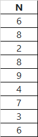

# TestForConvSoft - тестовое задание для компании ООО "Удобный Софт".

# Постановка задачи:
написать на Java\Spring (любых версий) сервис:
1. Должен быть доступен сваггер
2. В сваггере единственный контроллер с единственным методом
3. Метод должен принять на вход путь к локальному файлу в формате xlsx и число N
4. В файле в столбик находятся целые числа. Образец столбика:

5. Метод должен вернуть N-ное минимальное число из файла
6. Для поиска нельзя использовать библиотечные функции типа сортировки массива, нужно предложить и реализовать эффективный алгоритм (это важно)
7. Приложить инструкцию по сборке и запуску кода
   На задание не надо тратить много времени. Если есть идеи по улучшению, их можно дописать текстом.

# Краткое описание решения:
Сервис TestForConvSoft основан и реализует алгооритм т. н. быстрого выбора. Характеристики следующие:
- разделение на две части
- рекурсия
- средняя сложность O(n)
- худшее время O(n^2)
- позволяет избежать полной сортировки массива

# Стек:

- Java 1.8
- Maven 3.9.9
- SpringBoot 2.7.18
- Swagger 2.9.2

# Чтобы собрать и запустить приложение, нужно:
1. Убедиться, что установлена java 1.8
2. Установить maven, указанный выше
3. Запустить сборку из корня проекта с помощью команды `mvn clean package`
4. Запустить приложение с помощью команды `mvn spring-boot:run`
5. Затем открыть страничку приложения по адресу http://localhost:8080/swagger-ui.html

# TODO: Идеи по улучшению:
- можно выделить отдельный класс ошибок
- дополнить тестами
- можно перевести не другой, более современный стек
- можно выделить отдельной дополнительно валидацию элементов
- можно создать дружественный интерефейс для пользователя, а swagger оставить для тестировщиков и разработчиков
- можно дополнить функционал автоматическим генератором целых чисел в столбик
- можно увеличить перечень обрабатываемых файлов, а не только в формате xls